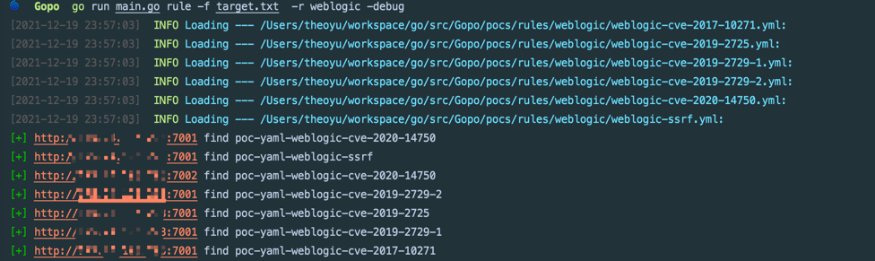
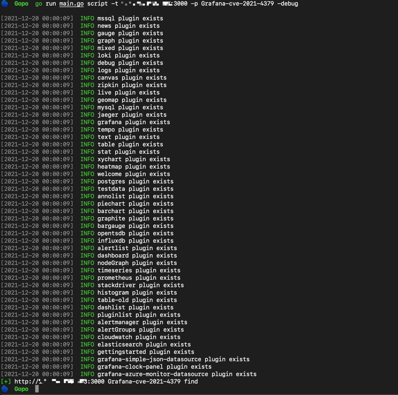

# Gopo

## Features

你可以用它来渗透测试，不过我保证绝对没有市面上绝大多数工具好用...

仅仅当作个人学习，用了一些好的项目，不自己造轮子还是感觉手痒

尽可能去支持v2的xray Poc，再自定义一些遇到的script 嗯差不多就这样

## Usage

### rule

```
OPTIONS:
   --poc-rules rules, -r rules  load multi pocs from rules,eg: struts2 or thinkphp
   --poc-file value, -p value   load single poc from poc-rules
   --target value, -t value     target to scan
   --target-file FILE, -f FILE  load target FILE to scan
   --proxy value                http proxy
   --num NUM, -n NUM            threats NUM to scan (default: 20)
   --cookie value               http cookie
   --httpDebug                  http debug (default: false)
   --debug                      set the log debug level (default: false)
   --help, -h                   show help (default: false)
```



### script
```
OPTIONS:
   --poc value, -p value        load poc script from scripts
   --proxy value                http proxy
   --num NUM, -n NUM            threats NUM to scan (default: 20)
   --cookie value               http cookie
   --target value, -t value     target to scan
   --target-file FILE, -f FILE  load target FILE to scan
   --httpDebug                  http debug (default: false)
   --debug                      set the log debug level (defau
```



## TODO
- [ ] 目前来看，rule在逻辑处理上还有很大的问题 比如以下情况

```yaml
rules:
  r0:
    ...
    expression: ...
  r1:
    ...
    expression: ...
expression: r0() && r1()
```
理想状态，应该在env创建时，把键名对应的函数注册，最后解析最外层expression时，再逐一执行。

问题是，注册函数时，function就已经需要传入env参数，这就有一个先鸡还是先蛋的问题了，于是干脆换了写法，一个一个rule全部执行完，再一起`Evaluate()`一次

两者的区别就在于，前者是按照最外层expression的顺序执行，后者是按照rule写的顺序执行。

通过xray的文档可以看到

>rule 的执行顺序是按照该逻辑表达式的执行顺序来执行的
>短路求值, 即 r1() || r2(), 如果 r1() 的结果为 true 那么 r2 是不会执行的

这一部分可能得重写

- [ ] rule的set目前是map[string]string，后续完善为map[string]interface{},这样带有一些爆破性质的script，也可以用rule解决。
- [ ] 整理struts2和weblogic相关的rule，补充完善cel的function
- [ ] script现在还只是url遍历执行，并发效果不好，协程之间的控制也不行。
- [ ] 总结一下shiro反序列化以及fastjson的检测script 学习 ==> 产出

## Reference

- 项目主要逻辑参考 https://github.com/jjf012/gopoc 

- 部分实现参考 https://github.com/jweny/pocassist 
- 文档参考 https://docs.xray.cool/#/guide/poc/v2
- cel相关学习 https://codelabs.developers.google.com/codelabs/cel-go/#0
