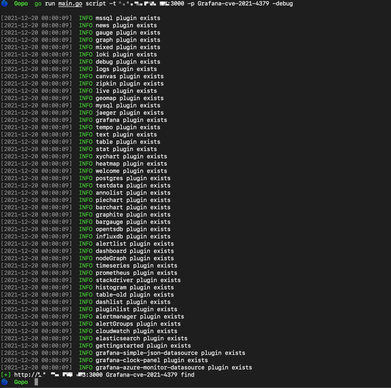

# Gopo
a poc framework supported for [XRAY V2's Poc](https://docs.xray.cool/#/guide/poc/v2) and custom script.
## Usage

### rule

```
OPTIONS:
   --poc-rules rules, -r rules  load multi pocs from rules,eg: struts2 or thinkphp
   --poc-file value, -p value   load single poc from poc-rules
   --target value, -t value     target to scan
   --target-file FILE, -f FILE  load target FILE to scan
   --proxy value                http proxy
   --num NUM, -n NUM            threats NUM to scan (default: 20)
   --cookie value               http cookie
   --httpDebug                  http debug (default: false)
   --debug                      set the log debug level (default: false)
   --ticker                     set the time ticker to add the Task (default: false)
   --help, -h                   show help (default: false)
```


如果多个poc使用了反连，请加上`--ticker`设置1秒的发包间隔，因为反连平台前的随机前缀是根据时间戳创建的，同一时间发包会造成误报。


### script
```
OPTIONS:
   --poc value, -p value        load poc script from scripts
   --proxy value                http proxy
   --num NUM, -n NUM            threats NUM to scan (default: 20)
   --cookie value               http cookie
   --target value, -t value     target to scan
   --target-file FILE, -f FILE  load target FILE to scan
   --httpDebug                  http debug (default: false)
   --debug                      set the log debug level (defau
```




## TODO

- [ ] set目前使用的类型是`map[string]string`，可能`map[string]interface{}`会更全面一些。
- [ ] script之间的并发处理
- [x] shiro & fastjson
- [ ] fastjson 全绕过
- [ ] spring RCE
- [ ] 执行决策方面，比如：

```yaml
rules:
  r0:
    ...
    expression: ...
  r1:
    ...
    expression: ...
expression: r0() || r1()
```

通过xray的文档可以看到

>rule 的执行顺序是按照该逻辑表达式的执行顺序来执行的
>短路求值, 即 r1() || r2(), 如果 r1() 的结果为 true 那么 r2 是不会执行的

但在cel注册函数时，就已经需要传入env参数，所以我目前解决的方式还是按rules依次执行，最后判断expression。

## Reference

- 项目主要逻辑参考 https://github.com/jjf012/gopoc 

- 部分实现参考 https://github.com/xiecat/pocassist 
- 文档参考 https://docs.xray.cool/#/guide/poc/v2
- cel相关学习 https://codelabs.developers.google.com/codelabs/cel-go/#0
